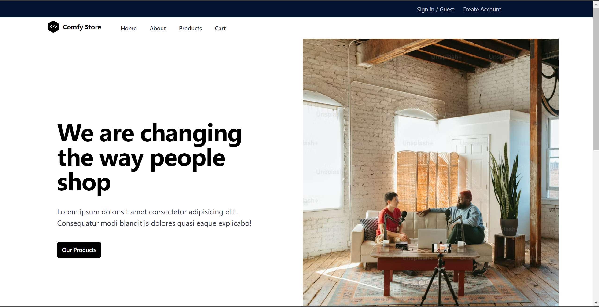
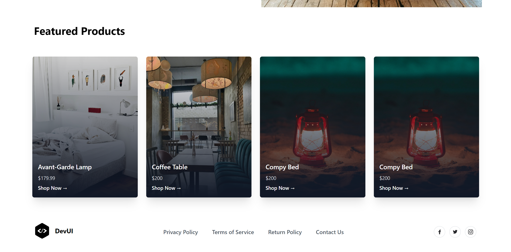
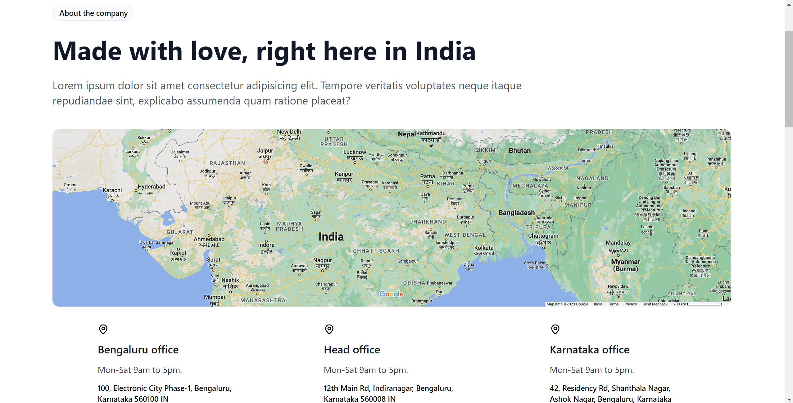
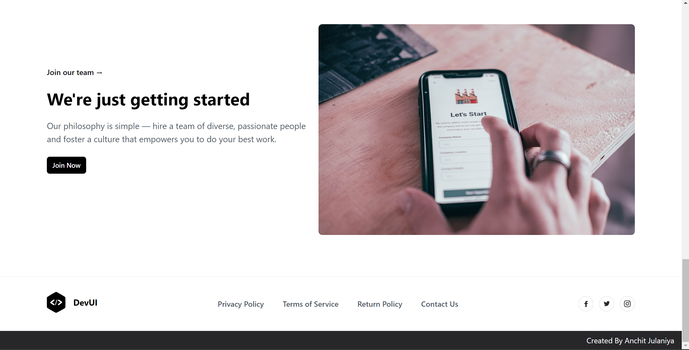

# ComfyStore [Link](https://comfy-shopping-by-anchit.netlify.app/)


ComfyStore is a dynamic and interactive e-commerce web application designed to streamline and enhance the online shopping experience. The application features local storage management, dynamic routing, secure authentication with private and public routes, and robust filtering and search functionalities.


## Table of Contents
- [Features](#features)
- [Technologies Used](#technologies-used)
- [Installation](#installation)
- [Usage](#usage)
- [Project Structure](#project-structure)
- [Contributing](#contributing)
- [License](#license)


## Features
1. **Local Storage**
   - Persist user data and preferences across sessions.
   - Save shopping cart items and user settings.

2. **Dynamic Routing**
   - Efficient and seamless navigation within the application using React Router.
   - Modular and scalable routing system for different components and pages.

3. **Authentication (Sign-in/Login) with Private and Public Routes**
   - Secure authentication system using JWT tokens.
   - Private routes to restrict access based on user authentication status.
   - Public routes for open access pages such as home and login.

4. **Complex Filter Functionality**
   - Advanced filtering options to refine product searches by categories, price ranges, ratings, etc.
   - State management to handle and update filter criteria dynamically.

5. **Search Functionality**
   - Robust search feature to quickly find products.
   - Debouncing to optimize search performance and user experience.










## Technologies Used
- **Frontend:** React, React Router, HTML, CSS, JavaScript
- **State Management:** Context API/Redux (if applicable)
- **Authentication:** JSON Web Tokens (JWT), Local Storage
- **Tools & Libraries:** Axios (for API calls), Formik (for form handling), Lodash (for utility functions)

## Installation
1. Clone the repository:
   ```sh
   git clone https://github.com/yourusername/comfystore.git
   cd comfystore
2. Install dependencies:
    ```sh
    npm install

3. Start the development server:
    ```sh
    npm start


## Usage
1. Open your browser and navigate to http://localhost:3000.
2. Explore the application, sign up or log in, and experience the features like filtering and searching for products.

## Prject Structure
    ```sh
    comfystore/
├── public/
├── src/
│   ├── components/
│   ├── pages/
│   ├── services/
│   ├── utils/
│   ├── App.js
│   ├── index.js
│   ├── routes.js
├── .gitignore
├── package.json
└── README.md


## Contributing
Contributions are welcome! Please fork the repository and create a pull request with your changes.

1. Fork the repository
2. Create your feature branch (git checkout -b feature/AmazingFeature)
3. Commit your changes (git commit -m 'Add some AmazingFeature')
4. Push to the branch (git push origin feature/AmazingFeature)
5. Open a pull request

## License
This project is licensed under the MIT License. See the LICENSE file for details

